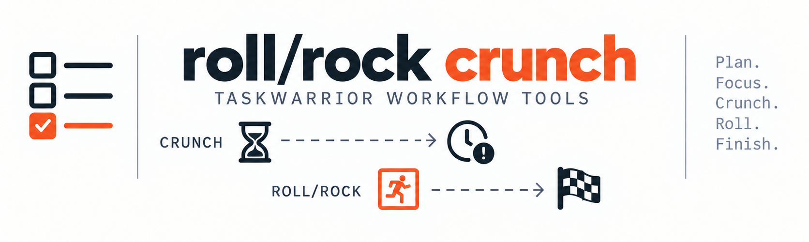

# Taskwarrior Roll/Rock + Crunch



Two dependency-free Taskwarrior hooks for keeping linked work scheduled, plus
Rock, Roll's companion planning command:

Release notes: [CHANGELOG.md](CHANGELOG.md)

- **Roll** moves dependent due dates when their predecessor moves or finishes.
- **Crunch** reports scheduling pressure without changing task dates.
- **Rock** plans backward through a Roll chain from a fixed finish-line deadline.
- Fixed checkpoints and finish-line milestones keep important dates stable.

## Requirements

- Python 3.10+
- Taskwarrior
- Git
- A POSIX shell (macOS, Linux, or WSL)

No Python packages are required.

## Install

These commands install both Roll and Crunch. Open Terminal and run:

```sh
git clone https://github.com/ylub/tw-roll-crunch.git
cd tw-roll-crunch
sh ./install.sh
```

The installer copies the hooks into `$HOME/.task/hooks` and installs
`task_roll_help` in `$HOME/.local/bin`. It does not need administrator access and
refuses to replace a hook or command with the same filename. Make sure
`$HOME/.local/bin` is in `PATH`.
If Taskwarrior uses a different data directory, provide its full path:

```sh
export TASKDATA=/path/to/task-data
sh ./install.sh
```

Next, while still inside the cloned `tw-roll-crunch` directory, connect the
included settings to Taskwarrior:

```sh
printf '\ninclude %s/config/taskrc.example\n' "$PWD" >> "$HOME/.taskrc"
```

Run that command once. If you use a custom `TASKRC` file, replace
`"$HOME/.taskrc"` with its path. Keep the cloned directory at this location;
the `include` line points to its `config/taskrc.example` file.

Verify the configuration and installed hooks:

```sh
task rc.hooks=0 show >/dev/null
task chain >/dev/null
task diagnostics
ls -l "${TASKDATA:-$HOME/.task}/hooks/on-exit-roll.py" \
      "${TASKDATA:-$HOME/.task}/hooks/on-modify.crunch.py" \
      "${TASKDATA:-$HOME/.task}/hooks/on-add.crunch.py"
```

The first two commands should finish without an error. Under `Hooks`,
diagnostics should list all three files as active. The final command should
also list all three; `on-add.crunch.py` should point to `on-modify.crunch.py`.

### Manual install

Roll and Crunch can be installed independently.

First choose the hook directory and create it:

```sh
HOOK_DIR="${TASKDATA:-$HOME/.task}/hooks"
mkdir -p "$HOOK_DIR"
```

Stop and back up or remove any same-named hook already in that directory before
running the manual commands.

Roll only:

```sh
install -m 0755 hooks/roll.py "$HOOK_DIR/on-exit-roll.py"
mkdir -p "$HOME/.local/bin"
install -m 0755 task_roll_help "$HOME/.local/bin/task_roll_help"
install -m 0755 task_rock "$HOME/.local/bin/task_rock"
install -m 0755 task_chain "$HOME/.local/bin/task_chain"
install -m 0755 task_chains "$HOME/.local/bin/task_chains"
```

Crunch only:

```sh
install -m 0755 hooks/crunch.py "$HOOK_DIR/on-modify.crunch.py"
ln -s on-modify.crunch.py "$HOOK_DIR/on-add.crunch.py"
```

Then add the supplied configuration to your Taskwarrior config as shown in the
main installation steps. Taskwarrior normally uses `~/.taskrc`; `TASKRC` can
select another file. The supported `include` syntax is documented in the
[Taskwarrior configuration guide](https://taskwarrior.org/docs/configuration/).

To uninstall, remove the three installed hook paths,
`$HOME/.local/bin/task_roll_help`, `$HOME/.local/bin/task_rock`, `$HOME/.local/bin/task_chain`, `$HOME/.local/bin/task_chains`, and the `include` line you added to your
Taskwarrior config. Removing hooks does not delete task data.

## Usage

### Crunch

Set `remaining` to your current estimate of work left. Update it after each
session. `progress` is an optional, manually maintained percentage:

```sh
task add "Long research task" due:2026-10-15 remaining:2d progress:0
task TASK_ID modify remaining:18h progress:25
```

Crunch uses `remaining` directly for easy-task and deadline pressure. It does
not reduce that estimate by `progress`; `progress` only affects the start
bonus. Adding or modifying a task recalculates its Crunch level.

Changing `remaining` does not move due dates. Roll schedules from
`roll_offset`, which is calendar spacing rather than estimated work.

See [docs/crunch.md](docs/crunch.md) for the complete scoring rules.

### Roll

Show the field guide and copyable examples:

```sh
task roll help
```

Create a weekday Roll chain from selected `_zshuuids` output. This previews
only; add `--apply` after checking the path:

```sh
task '/yv-/' _zshuuids | rg ':write yv-' > yv-chain.txt
task roll chain yv-chain.txt --start 2026-09-22 --finish 2026-10-07 --remaining 40m
```

Omit `--remaining` when selected tasks already have different `remaining`
estimates; Chain preserves them and lists every task without one.

Set weekly capacity for a project in `~/.taskrc`; dotted child projects inherit
their nearest parent value:

```ini
roll.capacity.posek=25
roll.capacity.other-project=12
```

`task chain` adds `CAPACITY` for each Rock finish-line path. It is the
available project hours from today through its deadline,
including Saturday and Sunday, minus the path's total `remaining` estimate.
`—` means the project has no capacity setting or a path task lacks `remaining`.
The `CAPACITY` column is a feasibility signal; it does not change `R_mark`.

For every linked task with `remaining` and a matching capacity, Roll calculates
its moving `roll_offset` as `remaining hours / weekly capacity * 7 days`.
Saturday and Sunday count. Roll rounds to 30-minute slots and refreshes the
offset and downstream flexible dates after any task change. For a once-daily
or otherwise intentional gap, preserve your own offset with:

```sh
task TASK_ID modify roll_manual:yes roll_offset:P1D
```

Roll still moves that task's due date from its predecessor. Clear the override
with `task TASK_ID modify roll_manual:` to resume capacity auto-spacing.

`task roll chain` creates a flexible chain. Use `task rock chain` with the
same arguments when the final task must stay fixed at `--finish`.

Show numbered active Roll paths, then inspect one path:

```sh
task chain
task chain 2
```

`task chain` shows root, task count, start, finish or leaf, deadline, capacity,
and status. `task chain NUMBER` shows every task in that path. Capacity is `—`
for flexible paths. `task chains view` remains the original compact chain
summary without numbering or capacity.

Show flexible link details and offsets:

```sh
task roll show
```

`task roll view` remains an alias for `task roll show`. The `R` column in either
command shows only flexible Roll links:
`󰍃 +GAP` means the task follows its predecessor by that moving gap. Fixed
checkpoints and Rock finish-lines appear in their dedicated views instead.

Point each rolling task at its predecessor and set the spacing with
`roll_offset`:

> **Warning:** Changing a predecessor's due date or completing it can update
> the due dates of ordinary linked children.

```sh
task TASK_ID modify roll:PREDECESSOR_UUID roll_offset:2d
task CHECKPOINT_ID modify roll:PREDECESSOR_UUID roll_offset:4d roll_fixed:checkpoint
task FINISH_ID modify roll:PREDECESSOR_UUID roll_offset:2d roll_fixed:finish-line
```

`checkpoint` preserves an intermediate date. `roll_fixed:finish-line` marks a
fixed finish-line milestone. A chain can be pictured as:

```text
A --2d--> B --4d--> C (checkpoint) --> D --> E (finish-line milestone)
```

Roll uses a predecessor's `due` time while it is active. On completion, it
applies `end + roll_offset` once and releases the ordinary child from the Roll
link. See [docs/roll.md](docs/roll.md) for field semantics, fixed dates, errors,
and cycle handling.

### Rock

Rock plans backward from a solid finish-line deadline. It never changes tasks:
it shows the one root date that ordinary Roll should use to schedule the chain
forward.

```sh
task rock FINISH_ID
task rock FINISH_ID --apply
```

`task rock FINISH_ID` is a dry run. `--apply` changes the printed root due date
only when the plan has no warnings; ordinary Roll then updates the chain.
Rock stops at checkpoints and refuses to apply when moving the root would also
roll another active branch.

`task chain` reads capacity fresh from `~/.taskrc` each time. Add or
change `roll.capacity.PROJECT=HOURS_PER_WEEK`, then rerun it; no task
modification or scheduler refresh is needed.

### Upgrading Roll displays

Roll v2 writes `r_mark` instead of `roll_mark`. The supplied config defines
both fields during the transition, and the new hook clears old marks as it
updates tasks. An existing `include` picks this up after updating the clone; if
you copied the UDA definitions instead, add `r_mark` before installing the new
hook. In custom reports, replace `roll_mark` with `r_mark` and change the
corresponding label to `R`.

## Upgrading from `duration`

Older Crunch setups used a `duration` UDA for the work estimate. Back up your
tasks and migrate those values before removing that UDA:

```sh
task rc.hooks=0 export > tasks-before-remaining.json
task TASK_ID modify remaining:OLD_VALUE duration:
```

Repeat the second command for each task that has `duration`, using its existing
value as `OLD_VALUE`. Keep both UDA definitions during the migration. Then
update the Crunch hook, reports, and configuration to use `remaining`.

## Tests

```sh
python3 -m unittest discover -s tests -v
```

## Credits and project relationship

This repository was built out with assistance from
[OpenAI Codex](https://openai.com/codex/), based on an existing Roll + Crunch
workflow and requirements supplied by [@ylub](https://github.com/ylub).

This is an independent third-party extension for
[Taskwarrior](https://taskwarrior.org/)
([source code](https://github.com/GothenburgBitFactory/taskwarrior)).
It was not created, maintained, sponsored, or endorsed by Taskwarrior or
Gothenburg Bit Factory. OpenAI and Codex did not create Taskwarrior.

## License

MIT. See [LICENSE](LICENSE).
